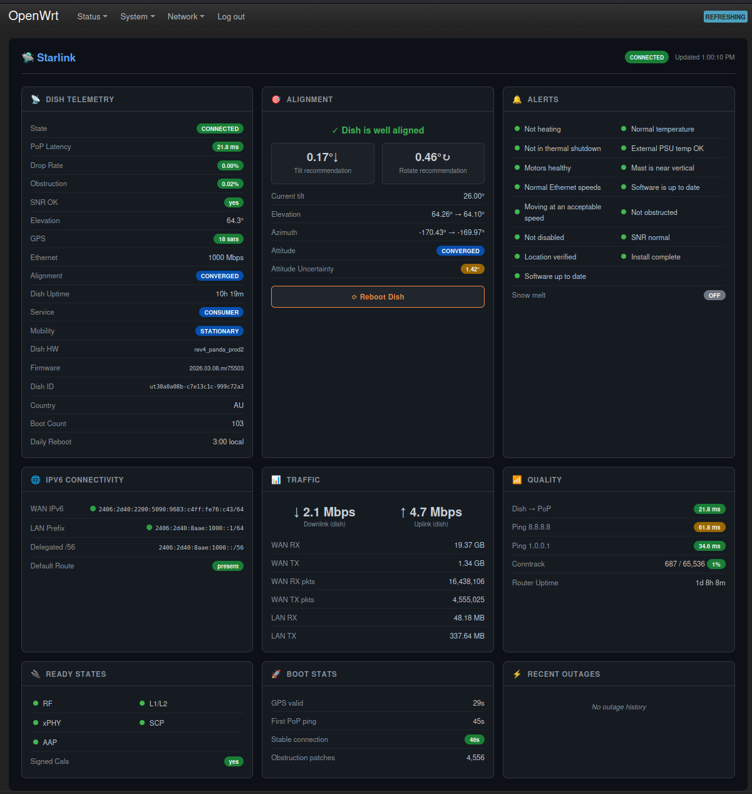

# starlink-panel

LuCI dashboard for Starlink dish telemetry, alignment, alerts, IPv6 connectivity, traffic, and router configuration on OpenWrt 25.x.
Works with Starlink Gen3 and higher dish.



---

## Features

- **Dish Telemetry** — state, uptime, latency, packet drop, obstruction %, throughput, SNR, GPS satellites, Ethernet speed, hardware/software version
- **Alignment** — tilt and rotation guidance (↑↓ / ↻↶) with "well aligned" confirmation when within 5°
- **Alerts** — 15 health indicators (heating, thermal throttle, shutdown, PSU throttle, motors, mast, slow Ethernet, software update, roaming, obstruction, disabled, SNR low, unexpected location, install pending, reboot required)
- **IPv6 Connectivity** — WAN address, LAN prefix, delegated /56, default route
- **Traffic** — instantaneous up/down throughput from dish gRPC, WAN and LAN byte/packet counters
- **Quality** — dish→PoP latency, pings to 8.8.8.8 / 1.0.0.1, conntrack usage, router uptime
- **Ready States** — RF, L1/L2, xPHY, SCP, AAP ready flags
- **Boot Stats** — time to GPS valid, first PoP ping, stable connection
- **Recent Outages** — last 6 outages with cause and duration
- **Reboot Dish** button with confirmation dialog

Auto-refreshes every 10 seconds.

> **Note:** The alignment data is sourced directly from the dish API and is more accurate than the Starlink phone app, which can incorrectly report misalignment of over 6° on a well-aligned dish. Trust the dashboard.

---

## Related

This package is designed to work alongside [starlink-openwrt-ipv6-optimized](https://github.com/bigmalloy/starlink-openwrt-ipv6-optimized) — a companion guide for setting up OpenWrt as a Starlink bypass router, covering IPv6, odhcpd prefix lifetime fixes, firewall, congestion control, and more.

---

## Requirements

| Requirement | Notes |
|-------------|-------|
| OpenWrt 25.x | Uses `apk` package manager; tested on 25.12.0 |
| Architecture | `aarch64_cortex-a53` for the `starlink-dish` binary; `PKGARCH=all` so the APK installs on any architecture |
| `luci-base` | LuCI web interface |
| `rpcd` | RPC daemon (usually pre-installed) |

---

## Installation

### Step 1 — Install the signing key (one-time)

**Via LuCI (System → Administration → Repo Public Keys):**
1. Download [starlink-panel-signing.pub](https://github.com/bigmalloy/starlink-panel/raw/main/keys/starlink-panel-signing.pub)
2. In LuCI go to **System → Administration**
3. Click the **Repo Public Keys** tab
4. Drag the downloaded `.pub` file into the box — it is added automatically

**Or via CLI:**
```sh
wget -O /etc/apk/keys/starlink-panel-signing.pub \
  https://raw.githubusercontent.com/bigmalloy/starlink-panel/main/keys/starlink-panel-signing.pub
```

### Step 2 — Install the package

**Via LuCI (System → Software):**
1. Download `luci-app-starlink-panel-*.apk` from the [latest release](../../releases/latest)
2. In LuCI go to **System → Software**
3. Click **Upload Package...**, select the `.apk` file, click **Upload**

**Or via CLI:**
```sh
scp -O luci-app-starlink-panel-*.apk root@192.168.1.1:/tmp/
ssh root@192.168.1.1 'apk add /tmp/luci-app-starlink-panel-*.apk'
```

Navigate to **Services → Starlink** in LuCI after install.

> The post-install script downloads `starlink-dish` in the background. Dish telemetry cards populate on the next poll once the binary is present.

---

## Build from Source

Requires Docker.

```sh
git clone https://github.com/bigmalloy/starlink-panel
cd starlink-panel
./build-apk-docker.sh
# Output: output/luci-app-starlink-panel-*.apk
```

Uses the official `openwrt/sdk:aarch64_cortex-a53-25.12.0-rc5` Docker image.

---

## Hardware Tested

| Device | GL-iNet Beryl AX (MT3000) |
|--------|---------------------------|
| SoC | MediaTek MT7981B |
| OpenWrt | 25.12.0 |
| Starlink | Gen3 dish (rev4_panda_prod2) |
| ISP | Starlink Residential (AU) |

---

## Buy me a beer

If this project saved you some time, feel free to shout me a beer!

[](https://paypal.me/bergfirmware)

---

## License

MIT
